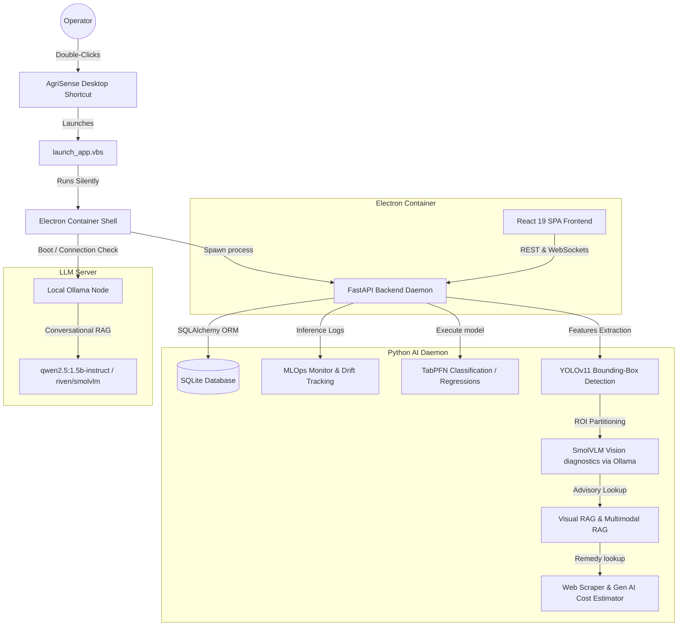

# 🌾 AgriSense Desktop

**AgriSense Desktop** is a native, offline-first AI-powered agriculture intelligence platform delivered as a single-click executable. By combining edge computing nodes, local vision models, tabular machine learning, and conversational AI, AgriSense delivers deep agronomy analytics directly to farmers, cooperatives, and researchers without requiring internet connectivity.

---

## 🏗️ System Architecture Diagram

AgriSense Desktop operates as a dual-runtime desktop application containerized with **Electron** and powered by a **FastAPI** Python AI daemon, local **Ollama** LLM node, and custom YOLOv11 bounding box inference logic.



---

## 🚀 Key Features

*   **Single-Click Boot:** Launches both the FastAPI python backend and the Electron browser window simultaneously with zero terminals or console windows visible.
*   **Enterprise-Grade AI Vision Diagnostics:** 
    *   **YOLOv11 Pipeline:** Locates leaves, fruits, stems, lesions, pests, and weeds instantly on the GPU (<150ms).
    *   **SmolVLM reasoning:** Executes visual question answering using `riven/smolvlm:latest` on cropped target ROIs.
    *   **Visual & Multimodal RAG:** Augments diagnostic outputs with scientific advisory journals.
    *   **Scraped Remedy Costs:** Queries online agricultural portals and uses Gen AI parsing to return cure costs in Indian Rupees (₹).
*   **Authentication & Roles:** Safe, offline user gates (Register / Login) using JWT tokens to distinguish between Farmers, Consultants, Researchers, and Enterprise Admins.
*   **Multi-Farm Field Contexts:** Manage multiple separate farm properties with dynamic selector switches, filtering sensor metrics and telemetry indicators based on active locations.
*   **Agri Marketplace:** An inputs ecommerce catalog (seeds, fertilizers, organic pesticides) with intelligent, automated diagnostic product recommendations.
*   **Local AI Hub:** A real-time hardware status monitor displaying CPU, RAM, and GPU VRAM usage alongside control triggers to toggle local LLMs or vision networks.
*   **Conversational AgriGPT:** A RAG chatbot grounded in a verified agronomy knowledge base powered by `qwen2.5:1.5b-instruct`.

---

## 🛠️ The Tech Stack

### Frontend
*   **React 19 & TypeScript:** State-of-the-art UI orchestration.
*   **Vite:** Sub-millisecond HMR compiler.
*   **Tailwind CSS v4:** Modern styling system utilizing premium soil and harvest design tokens.
*   **Motion (Framer Motion):** Smooth micro-animations and panel entries.
*   **Recharts:** Hardware-accelerated SVG graphs (Radar, Line, Area, Bar).

### Backend
*   **FastAPI & Python 3.12:** High-concurrency async REST API gateway.
*   **SQLAlchemy:** ORM abstraction mapping database schemas.
*   **SQLite:** Embedded relational storage.

### AI / ML Models
*   **Crop & Irrigation Analytics:** TabPFN & FT-Transformer.
*   **Leaf Disease Pathology:** riven/smolvlm via local Ollama.
*   **Feature Detection:** Custom YOLOv11m / YOLOv11s.
*   **Anomaly detection:** Extended Isolation Forest (EIF).
*   **Chatbot & RAG:** Ollama + Qwen2.5 1.5B (Instruct).

---

## 🗂️ Technical Directory Structure

```
├── electron_main.cjs   # Electron main process manager (spawns FastAPI and verifies Ollama)
├── launch_app.vbs      # Silent launcher script hiding console windows on startup
├── package_desktop_app.ps1 # Compiles React and builds final installer setup
├── backend/            # Python FastAPI backend
│   ├── main.py         # Gateway server config & static mounting
│   ├── models.py       # SQLAlchemy schemas (users, farms, model_registry, logs)
│   ├── auth_routes.py  # User registration and JWT login routes
│   ├── farm_routes.py  # Multi-farm context controllers
│   ├── marketplace_routes.py # Marketplace inputs catalog & recommendations
│   ├── system_routes.py # Local hardware NVML monitoring & licenses
│   ├── ml/             # YOLOv11 & SmolVLM training trainers
│   ├── vision/         # YOLO pipeline router & remedy cost scraper
│   └── llm/            # AgriGPT RAG chatbot integrations
└── src/                # Vite React 19 Frontend source code
    ├── App.tsx         # Layout, nav sections, and active farm context switcher
    └── pages/          # View pages (Login, Dashboard, Marketplace, LocalAIHub, MLOps)
```

---

## 🏁 How to Build and Run

### 1. Prerequisites
*   [Node.js (F:\FULL-STACK)](file:///f:/FULL-STACK)
*   Python 3.12 (Miniconda environment `dgpu-core`)
*   Ollama running locally with `riven/smolvlm:latest` and `qwen2.5:1.5b-instruct`

### 2. Development Startup
To run the full workspace locally in developer mode:
1. Start your local Ollama engine.
2. In the project directory, run:
   ```powershell
   npm run dev
   ```

### 3. Packaging into Windows Installer
To package the React files, bundle python dependencies via PyInstaller, and build the native Windows installer, execute:
```powershell
.\package_desktop_app.ps1
```
The compiled installer will be saved under:
`dist-desktop/AgriSense Setup 0.0.0.exe`
