# 🌾 AgriSense: Air-Gapped Native Edge PaaS Solution for Sustainable Agriculture

**AgriSense** is a 100% offline, air-gapped, native Edge PaaS (Platform-as-a-Service) agriculture intelligence system. Designed to run completely on edge hardware with **0 cloud API calls**, AgriSense integrates spatial PostGIS database persistence, local vector stores via Qdrant, multi-agent AI swarms powered by LangGraph & PydanticAI, state-of-the-art vision networks (Florence-2 & YOLOv11), tabular ML models (TabPFN & FT-Transformer), and built-in security and telemetry guardrails.

---

## 🏗️ System Architecture Diagram

AgriSense operates as a single-port unified FastAPI PaaS gateway serving the React 19 single-page application directly alongside high-concurrency async REST and WebSocket channels.

```mermaid
graph TD
  Operator((Farmer / Operator)) -->|HTTP / Local Web| Gateway[Unified FastAPI PaaS Gateway - Port 8000]
  
  subgraph Client & Edge Interface
    Gateway -->|Static Serve| SPA[React 19 Frontend SPA]
    Gateway -->|Middleware| Security[Security Shield: Presidio PII & Prompt Injection]
  end

  subgraph Local Vector & DB Layer
    FastAPI[FastAPI Router Engine] -->|PostGIS / Spatial| Postgres[(PostgreSQL / PostGIS DB)]
    FastAPI -->|BGE-M3 Embeddings| Qdrant[(Qdrant Local Vector Engine)]
  end

  subgraph LangGraph & PydanticAI Multi-Agent Swarm
    FastAPI -->|Dispatch| Swarm[LangGraph State Orchestrator]
    Swarm --> Agronomist[Agronomist Agent]
    Swarm --> Market[Agri Marketplace Agent]
    Swarm --> Economics[Agricultural Economics Agent]
  end

  subgraph Local Model Runtimes
    FastAPI -->|Inference| TabPFN[TabPFN Crop & Fertilizer Regressors]
    FastAPI -->|Yield Prediction| FTT[FT-Transformer Yield Predictor]
    FastAPI -->|Anomaly Detection| EIF[Extended Isolation Forest]
    FastAPI -->|Vision VQA| Florence[HuggingFace Florence-2]
    FastAPI -->|Weed & Pest Detection| YOLO[Ultralytics YOLOv11]
  end

  subgraph Edge Telemetry & Notifications
    FastAPI -->|Traces| Telemetry[OpenTelemetry & Span Logger]
    FastAPI -->|Webhooks| N8N[n8n Webhook Alert Engine]
    FastAPI -->|SLM Node| Ollama[Local Ollama: qwen2.5:1.5b-instruct]
  end
```



---

## 🚀 Key Features

*   **100% Air-Gapped Native Edge PaaS:** 0 external cloud dependencies or API subscriptions. All LLM, SLM, vector search, vision, and tabular ML inference run locally on edge hardware.
*   **LangGraph & PydanticAI Multi-Agent Swarm:** Multi-agent collaboration replacing legacy frameworks. Executes specialized workflows for Agronomy, Market Product Matching, and Input ROI/Cost forecasting.
*   **Qdrant Vector Database:** Exclusively handles Multimodal RAG (MRAG) and Vision RAG (VRAG) with automatic in-memory fallbacks for concurrent test safety.
*   **Security Shield Middleware:** Integrated HTTP request protection featuring Microsoft Presidio-grade PII redaction (email, phone, credentials), prompt injection detection, and rate limiting.
*   **Enterprise AI Vision & Tabular ML:**
    *   **Florence-2 & YOLOv11 Pipeline:** High-precision leaf disease detection, weed classification, and bounding-box spatial localization.
    *   **TabPFN & FT-Transformer:** Ultra-fast tabular crop recommendation, fertilizer optimization, and yield prediction.
    *   **Extended Isolation Forest (EIF):** Unsupervised anomaly detection on real-time field IoT sensor streams.
*   **OpenTelemetry & n8n Observability:** Native span tracing (`/api/agriops/telemetry/traces`) and asynchronous webhook triggers alerting on rate-limit violations, prompt injections, or system diagnostic alerts.
*   **Unified Single-Server Deployment:** Serves the compiled React 19 SPA directly from FastAPI static assets on port 8000.

---

## 🛠️ The Tech Stack

### Frontend & UI
*   **React 19 & TypeScript:** High-performance user interface.
*   **Vite & Tailwind CSS:** Modern styling and sub-millisecond build times.
*   **Motion & Recharts:** Interactive micro-animations and hardware telemetry charts.

### Backend & Core PaaS
*   **FastAPI & Python 3.13 / 3.12:** High-throughput async REST API.
*   **PostgreSQL & PostGIS:** Spatial indexing, geospatial field constraints, and ACID transactions.
*   **Qdrant:** Local vector engine supporting dense 1024-d BGE-M3 embeddings for MRAG/VRAG.

### Agents & Multi-Agent AI
*   **LangGraph:** Directed acyclic state-graph workflow orchestration.
*   **PydanticAI & Ollama:** Structured type-safe agent execution against local `qwen2.5:1.5b-instruct`.

### Computer Vision & Tabular Machine Learning
*   **Crop & Fertilizer Models:** TabPFN & FT-Transformer.
*   **Disease Pathology & Vision:** HuggingFace Florence-2 & Ultralytics YOLOv11.
*   **Sensor Anomaly Detection:** Extended Isolation Forest (EIF).

### Security & Observability
*   **Security Shield:** Regex PII redaction, prompt injection guardrails, and sliding-window rate limiting.
*   **OpenTelemetry:** Instrumented span traces and n8n webhook notifications.

---

## 🔑 Default Login Credentials

| Role | Email | Password |
| :--- | :--- | :--- |
| **Admin** | `admin@agrisense.io` | `admin123` |
| **Farmer** | `farmer@agrisense.io` | `farmer123` |

---

## 🗂️ Technical Directory Structure

```
├── start_single_server.bat     # Single-click batch script compiling React SPA and launching FastAPI PaaS server
├── backend/                    # Core Python FastAPI Edge PaaS Backend
│   ├── main.py                 # Gateway server, static SPA mounting, & SecurityShield middleware
│   ├── security/
│   │   ├── shield.py           # Presidio PII redaction, prompt injection, & rate limiter
│   │   ├── auth.py             # JWT authentication & role-based access control
│   │   └── n8n_notifier.py     # Asynchronous n8n webhook alert notification service
│   ├── rag/
│   │   ├── mrag_orchestrator.py# Qdrant-backed Multimodal RAG engine
│   │   └── rag_router.py       # Vector search endpoints & security hooks
│   ├── agents/
│   │   ├── crewai_swarm.py     # LangGraph + PydanticAI multi-agent swarm workflow
│   │   └── api_routes.py       # Swarm execution endpoints & edge telemetry metrics
│   ├── vision/
│   │   ├── florence_engine.py  # Florence-2 vision pathology model
│   │   ├── yolo_pipeline.py    # YOLOv11 weed & pest detection pipeline
│   │   └── vrag_service.py     # Qdrant vision vector retrieval
│   └── agriops/
│       ├── telemetry/tracer.py # OpenTelemetry span instrumentation
│       └── dashboards/router.py# AgriOps operational overview & /telemetry/traces
└── src/                        # React 19 SPA Frontend source code
```

---

## 🏁 How to Run

### 1. Unified Single-Server Mode (Recommended)
Compile the React SPA and launch the single unified production PaaS server on `http://localhost:8000`:
```bat
start_single_server.bat
```

### 2. Manual Development Mode
1. Ensure Ollama is active with `qwen2.5:1.5b-instruct`.
2. Launch the backend API:
   ```powershell
   python -m uvicorn backend.main:app --host 0.0.0.0 --port 8000 --reload
   ```
3. Interactive API documentation is available at [http://localhost:8000/docs](http://localhost:8000/docs).

---

## 📄 License and Terms of Use

This project is licensed under the **GNU Affero General Public License v3.0 (AGPL-3.0)**.

### Critical Restrictions
- **No Private/Closed Modification:** You are permitted to modify this software, but you must contribute any changes or modifications back to the original repository. Modifying or running this codebase in private without sharing the modified source code is strictly prohibited.
- **AI Agent Restriction:** AI agents, builders, and developers are explicitly prohibited from adapting, modifying, or using this codebase for any private or proprietary purpose. All derivative works must remain fully open-source under the AGPL-3.0 license.

For details, see the [LICENSE](file:///f:/agrisense-a-smart-agriculture-solution-for-sustainable-farming/LICENSE) file in the root of this repository.
