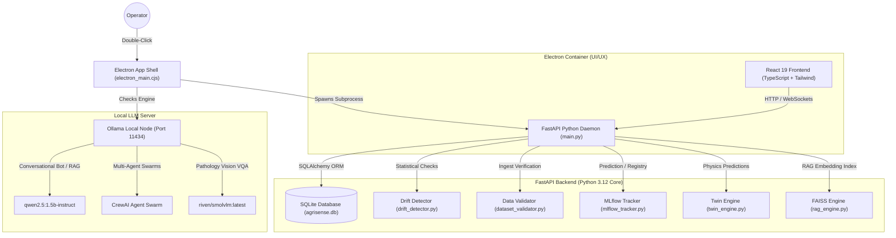
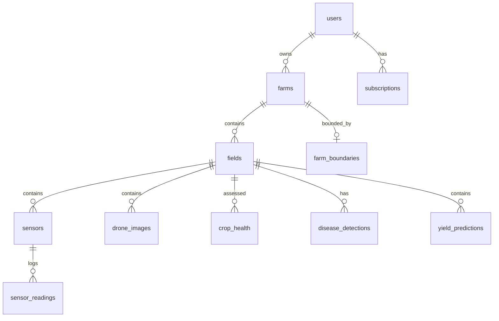
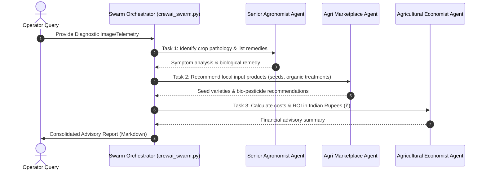

# 🌾 AgriSense: Master Blueprint & End-to-End System Analysis

This document provides a highly detailed master blueprint and architectural analysis of **AgriSense**, an offline-first AI-powered agriculture intelligence platform. It details all operations including Frontend UI/UX, Backend APIs, AI Models, MLOps, DataOps, LLMOps, AgentOps, and database schemas.

---

## 🗺️ 1. System Architecture & Runtime Topology

AgriSense is packaged as a single desktop app container. It orchestrates three local execution boundaries:



---

## 🎨 2. Frontend UI/UX Design System

The frontend leverages React 19 to provide real-time updates and interactive views.

### Design Tokens & Aesthetics
*   **Colors:** Curated, earthy agricultural palette (soil brown, forest green, wheat yellow) configured through Tailwind CSS variables.
*   **Typography:** Modern typography using Google Fonts (Outfit / Inter) to replace browser defaults.
*   **Interactivity:** Smooth micro-animations powered by **Motion (Framer Motion)** to enhance page transitions, hover states, and dynamic widgets.
*   **Charts:** Hardware-accelerated SVG graphs utilizing **Recharts** to plot sensor telemetry, predicted moisture trends, and crop yield curves.

### Page Configurations
*   [Dashboard.tsx](file:///f:/agrisense-a-smart-agriculture-solution-for-sustainable-farming/src/pages/Dashboard.tsx): Main hub summarizing crop stress indexes, weather, and YOLO diagnostics.
*   [DigitalTwin.tsx](file:///f:/agrisense-a-smart-agriculture-solution-for-sustainable-farming/src/pages/DigitalTwin.tsx): Physics-guided twin simulator with what-if buttons to evaluate crop health impacts.
*   [DiseaseDetection.tsx](file:///f:/agrisense-a-smart-agriculture-solution-for-sustainable-farming/src/pages/DiseaseDetection.tsx): Local vision module displaying annotated leaf image uploads, YOLO bounding boxes, and SmolVLM diagnosis.
*   [MLOpsDashboard.tsx](file:///f:/agrisense-a-smart-agriculture-solution-for-sustainable-farming/src/pages/MLOpsDashboard.tsx): Interface for model registers, performance charts, distribution drift checks, and rollback buttons.
*   [AgentDashboard.tsx](file:///f:/agrisense-a-smart-agriculture-solution-for-sustainable-farming/src/pages/AgentDashboard.tsx): Swarm status, showing live agent thoughts, tool execution steps, and task performance metrics.

---

## ⚙️ 3. Backend API Gateway & Database Schema

The backend is built with FastAPI, using SQLAlchemy to interface with an embedded SQLite database.

### 💾 Complete Database Schema Blueprint (`models.py`)
All relational schemas are defined inside the [models directory](file:///f:/agrisense-a-smart-agriculture-solution-for-sustainable-farming/backend/database/models/__init__.py):



1.  **Users & Access Control:**
    *   `users` table: Stores `email` (indexed via Trigram index), `hashed_password`, `role` (Admin, Farmer, Researcher, Student), and `preferred_language`.
    *   `roles` & `permissions` tables: Handle role-based access gates.
2.  **Farm Topology:**
    *   `farms` table: Tracks farm identifiers, name, and owner relation (`owner_id` -> `users.id`).
    *   `fields` table: Maps specific fields, crop types, and area metrics (`area_acres`) to a farm.
    *   `farm_boundaries` table: Stores coordinates using GeoAlchemy `Geography` polygon columns.
3.  **Sensor Telemetry:**
    *   `sensors` table: Maps hardware device IDs to fields, storing point coordinates and `last_seen` timestamps.
    *   `sensor_readings` table: Stores telemetry indicators including `soil_moisture`, `temperature`, `humidity`, `ph`, `nitrogen`, `phosphorus`, and `potassium`.
4.  **AI/ML Logs & Registry:**
    *   `model_registry` table: Tracks model name, active version, framework, accuracy, F1-score, and retraining logs.
    *   `prediction_logs` table: Stores input json data, outputs, prediction confidence, latency (ms), and calculated statistical drift.

---

## 🤖 4. AI/ML Engineering Blueprint

AgriSense combines tabular, vision, and language models to offer a comprehensive intelligence suite:

```
Telemetry Ingest ──► Anomaly Checker (Extended Isolation Forest)
                       │
                       ├─► Normal: Update Twin Engine ──► TabPFN (Crop Rec) / FT-Transformer (Yield)
                       │
                       └─► Outlier: Flag Sensor Fault & Trigger Re-Calibration
```

### Model Specifications
*   **TabPFN (`tabpfn_engine`):** Evaluates soil nitrogen, phosphorus, potassium (NPK), temperature, and humidity inputs to classify crop recommendation candidates.
*   **FT-Transformer (`yield_transformer`):** Analyzes multi-dimensional climate parameters, pesticide use, and historical yields to predict future tonnage.
*   **Extended Isolation Forest (`eif_detector`):** Monitors incoming telemetry streams to catch outliers, identifying hardware sensor faults or irrigation valve leaks.
*   **YOLOv11 (`yolo_pipeline`):** Detects plant features (leaves, stems) and pathology targets (pests, weeds) on local GPUs in under 150ms.

---

## 🧬 5. MLOps (Drift & Lifecycle Tracking)

AgriSense includes a localized ML monitoring layer:

### Statistical Drift Engine
The drift engine ([drift_detector.py](file:///f:/agrisense-a-smart-agriculture-solution-for-sustainable-farming/backend/mlops/drift_detector.py)) uses two algorithms to compare new sensor readings against a reference dataset:

1.  **Population Stability Index (PSI):**
    $$\text{PSI} = \sum \left( (P_{\text{actual}} - P_{\text{expected}}) \times \ln\left(\frac{P_{\text{actual}}}{P_{\text{expected}}}\right) \right)$$
    *   $\text{PSI} < 0.1$: Distribution remains stable.
    *   $\text{PSI} \ge 0.25$: Triggers a data drift warning and flags models for retraining.
2.  **Kolmogorov-Smirnov (KS) Test:**
    *   Calculates the empirical cumulative distribution differences between datasets. If the computed $p$-value falls below $0.05$, a drift warning is issued.

### Experiment Tracker & Version Control
*   Tracks runs locally via MLflow (falling back to a local `mlflow_runs.json` registry file).
*   Enables version promotions and rollbacks to restore stable, non-drifted model states.

---

## 📊 6. DataOps Pipeline

The data pipeline utilizes **Data Version Control (DVC)** (`dvc.yaml`) to automate the ingestion, validation, and training stages:

```
  Step 1: Validate Raw Data (dataset_validator.py)
            │
            ▼
  Step 2: Check Feature Drift (data_drift_monitor.py)
            │
            ▼
  Step 3: Trigger Multi-Model Retraining Pipelines
      ├── TabPFN Tabular Model
      ├── FT-Transformer Yield Predictor
      └── YOLO Weed/Pathology Detectors
            │
            ▼
  Step 4: Rebuild FAISS Vector Index (faiss_builder.py)
```

---

## 🗂️ 7. LLMOps & Conversational RAG

Conversational intelligence is designed for offline execution on edge hardware:

*   **Local LLM Service ([ollama_service.py](file:///f:/agrisense-a-smart-agriculture-solution-for-sustainable-farming/backend/ollama_service.py)):** Interacts with a local Ollama node running `qwen2.5:1.5b-instruct` to process agronomy chatbot queries.
*   **Multimodal RAG (MRAG):** When YOLO detects a leaf pathology, it crops the bounding box, uses `SmolVLM` to generate a clinical description, and searches a local **FAISS** vector store to retrieve appropriate treatment guidelines.

---

## 🤖 8. AgentOps (Autonomous Swarm Architecture)

The system deploys an agent-based software organization structure:



### Agent Foundation Layer
*   [base_agent.py](file:///f:/agrisense-a-smart-agriculture-solution-for-sustainable-farming/backend/agents/base_agent.py): Implements retry logic, self-health checks, tool registrations, and logs task outcomes to `memory_system`.
*   [crewai_swarm.py](file:///f:/agrisense-a-smart-agriculture-solution-for-sustainable-farming/backend/agents/crewai_swarm.py): Groups the Agronomist, Marketplace, and Economist agents into a sequential workflow execution pipeline.

---

## 🌡️ 9. Digital Twin Simulation Engine

The Digital Twin engine ([twin_engine.py](file:///f:/agrisense-a-smart-agriculture-solution-for-sustainable-farming/backend/twin_engine.py)) calculates environmental indicators to forecast irrigation and soil needs:

### 🧮 Mathematical Formulas

#### 1. FAO-56 Penman-Monteith Evapotranspiration ($ET_0$)
To model water loss through evaporation and crop transpiration:
$$ET_0 = \frac{0.408 \Delta R_n + \gamma \frac{900}{T + 273} u_2 (e_s - e_a)}{\Delta + \gamma (1 + 0.34 u_2)}$$
*   $R_n$: Net solar radiation ($15.0\,\text{MJ/m}^2/\text{day}$).
*   $T$: Mean air temperature ($^\circ\text{C}$).
*   $u_2$: Wind speed at $2\,\text{m}$ height ($\text{m/s}$).
*   $e_s - e_a$: Vapor pressure deficit ($\text{kPa}$).
*   $\Delta$: Slope of vapor pressure curve.
*   $\gamma$: Psychrometric constant ($0.066\,\text{kPa}/^\circ\text{C}$).

#### 2. Soil Moisture Forecasting
Moisture changes over $N$ days are simulated using a physics model with AI error corrections:
$$M_{d+1} = M_d + 0.4 \cdot \text{Rain} + 0.3 \cdot \text{Irrigation} - 0.8 \cdot ET_0 - \text{Drainage} + \epsilon_{\text{AI}}$$
*   **Drainage:** Modeled as $1.2\,\text{mm/day}$ if moisture $M_d > 45\%$, and $0.4\,\text{mm/day}$ otherwise.
*   **AI Correction ($\epsilon_{\text{AI}}$):** Compensates for environmental anomalies:
    $$\epsilon_{\text{AI}} = 0.4 \sin(d \cdot 0.6) - \text{bias}$$
    *   $\text{bias} = -0.5$ if moisture drops below $25\%$, and $0.2$ otherwise.
